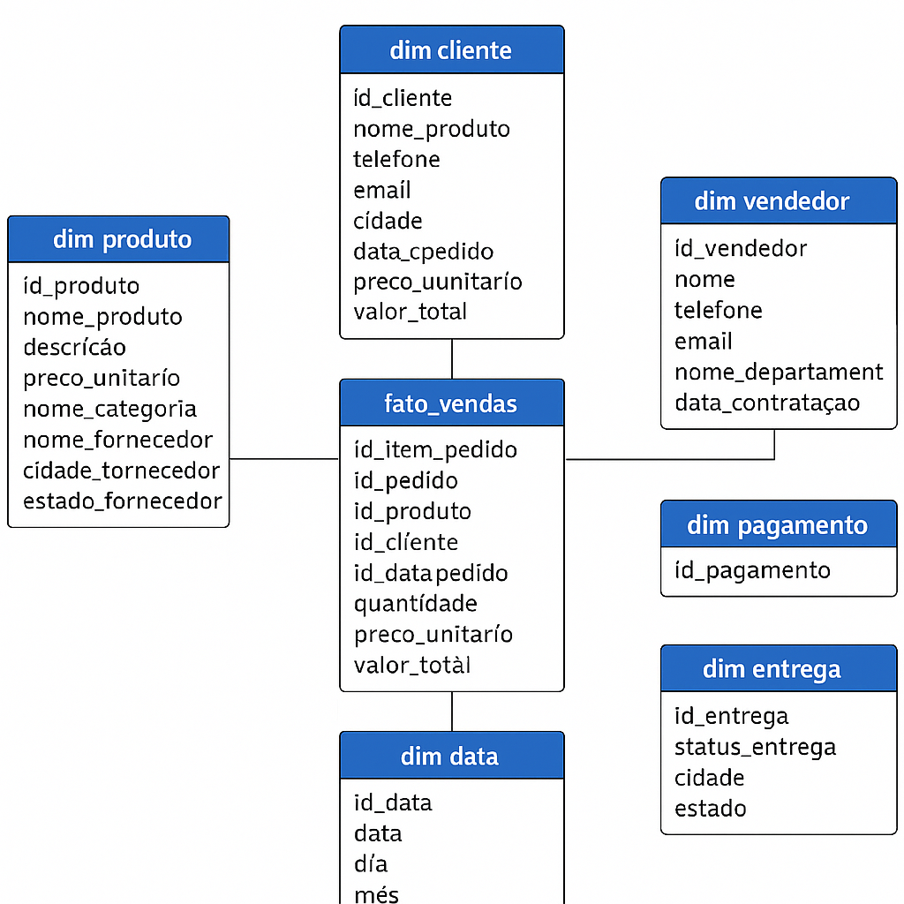

# 🏗️ Pipeline de Geração e Transformação de Dados Sintéticos com Docker, Airflow + DBT

## 📌 Resumo do Projeto
Pipeline automatizado e modular para gerar, transformar e disponibilizar dados sintéticos de uma empresa fictícia de materiais de limpeza, utilizando containers Docker para facilitar a execução e reprodutibilidade do ambiente.

---

## 🩺 Contexto e Problema
Empresas de varejo e atacado precisam analisar dados de vendas, clientes e estoque, mas nem sempre possuem bases de dados estruturadas para testes. A construção manual desses dados pode ser trabalhosa e pouco escalável.

Este projeto resolve o problema criando um pipeline baseado em Docker, que gera, transforma e disponibiliza tabelas analíticas para simular um ambiente de vendas e logística.

---

## 🎯 Objetivos
- Gerar dados sintéticos de vendas, clientes e estoque
- Containerizar o ambiente para facilitar deploy e reprodução
- Automatizar a transformação e validação dos dados
- Construir um pipeline escalável com Airflow e DBT
- Simular relatórios de BI para análise de desempenho

---

## 🧰 Stack Tecnológica
- **Containers:** Docker + Docker Compose
- **Orquestração:** Apache Airflow
- **Transformação:** DBT (Data Build Tool)
- **Armazenamento:** PostgreSQL (em container)
- **Geração de Dados:** Faker, pandas
- **Visualização (opcional):** Metabase, Power BI ou Streamlit

---

## ⚙️ Estrutura do Projeto

```plaintext
pipeline-airflow-dbt/
├── dags/                        # DAGs do Airflow (orquestração)
│   └── example_dag.py
├── dbt/                         # Projeto DBT (transformações analíticas)
│   ├── models/
│   │   └── example_model.sql
│   ├── seeds/
│   │   └── example_seed.csv
│   ├── dbt_project.yml
│   └── profiles.yml
├── data/                        # Dados em diferentes estágios
│   ├── raw/
│   ├── processed/
│   └── analytics/
├── src/                         # Código-fonte principal
│   ├── ingestion/
│   │   └── generate_data.py
│   ├── processing/
│   │   └── cleaning.py
│   ├── transformation/
│   │   └── enrich.py
│   ├── validation/
│   │   └── schema_check.py
│   ├── utils/
│   │   └── logger.py
│   └── __init__.py
├── scripts/                     # Scripts auxiliares
│   ├── run_pipeline.py
│   └── setup_env.py
├── tests/                       # Testes unitários e integração
│   ├── ingestion/
│   │   └── test_generate_data.py
│   ├── processing/
│   │   └── test_cleaning.py
│   ├── transformation/
│   │   └── test_enrich.py
│   ├── validation/
│   │   └── test_schema_check.py
│   └── utils/
│       └── test_logger.py
├── notebooks/                   # Notebooks para exploração
│   └── exploracao_dados.ipynb
├── configs/                     # Configurações e variáveis
│   ├── config.yaml
│   └── .env.example
├── requirements.txt
├── docker-compose.yml
└── README.md
```

---

## 📦 Modelagem Dimensional – Projeto Vendas

### 🧠 Processo de Negócio
Venda de produtos por clientes, registrados em pedidos e entregues em endereços, com pagamentos e avaliações.

### 📏 Grão da Fato Principal
Cada linha representa um item vendido em um pedido.

### 📊 Tabela Fato: `fato_vendas`
- id_item_pedido
- id_pedido
- id_cliente
- id_produto
- id_vendedor
- id_data_pedido
- quantidade
- preco_unitario
- valor_total

### 🧩 Tabelas de Dimensão

**dim_cliente**
- id_cliente
- nome
- tipo_cliente
- telefone
- email
- cidade
- estado
- data_cadastro

**dim_produto**
- id_produto
- nome_produto
- descricao
- preco_unitario
- nome_categoria
- nome_fornecedor
- cidade_fornecedor
- estado_fornecedor

**dim_vendedor**
- id_vendedor
- nome
- telefone
- email
- nome_departamento
- data_contratacao

**dim_data**
- id_data
- data
- dia
- mês
- ano
- trimestre
- dia_da_semana
- feriado

---

## ⭐ Star Schema

Representação visual da modelagem dimensional proposta:



---

## 🏗️ Camadas do Projeto

### 1. Camada RAW / Staging (`models/staging/`)
Tratamento dos dados brutos:
- Limpeza de inconsistências
- Padronização de formatos
- Eliminação de nulos e duplicatas
- Conversões de tipos (ex: datas, numéricos)

**Modelos incluídos:**
- `stg_clientes.sql`, `stg_enderecos.sql`, `stg_produtos.sql`
- `stg_vendedores.sql`, `stg_departamentos.sql`, `stg_pedidos.sql`
- `stg_itens_pedido.sql`, `stg_pagamentos.sql`, `stg_entregas.sql`
- `stg_categorias.sql`, `stg_fornecedores.sql`, `stg_datas.sql`, `stg_feriados.sql`

### 2. Camada de Modelagem (`models/marts/`)
Modelos incrementais que inserem dados diretamente nas tabelas físicas criadas no banco. Cada dimensão é populada e atualizada de forma incremental.

**Modelos incluídos:**
- `dim_cliente.sql`
- `dim_produto.sql`
- `dim_vendedor.sql`
- `dim_pagamento.sql`
- `dim_entrega.sql`
- `dim_data.sql`
- `fato_vendas.sql`

## 🧪 Testes Automatizados

Cada dimensão e fato tem testes definidos via arquivos `.yml`, como:
- `not_null` — campos obrigatórios
- `unique` — chaves primárias
- `accepted_values` — domínios válidos
- `relationships` — integridade referencial

## 📚 Documentação DBT e Data Lineage

O projeto utiliza o [DBT Docs](https://docs.getdbt.com/docs/building-a-dbt-project/documentation) para documentar todos os modelos, fontes, testes e dependências do pipeline de dados.

- Para visualizar a documentação interativa e o lineage graph, rode:

  dbt docs generate
  dbt docs serve --port 8080

## 🚦 Orquestração com Apache Airflow

O projeto utiliza o [Apache Airflow](https://airflow.apache.org/) para orquestrar e automatizar o pipeline de dados, garantindo que as etapas de ingestão, transformação (DBT) e validação sejam executadas de forma controlada e agendada.

- As DAGs (pipelines) ficam na pasta `dags/`.
- O Airflow é executado em container Docker, acessível em [http://localhost:8080](http://localhost:8080).

## ✅ Boas Práticas de Engenharia de Dados

- **Separação de camadas:** Dados brutos, staging e modelos analíticos organizados em pastas distintas.
- **Versionamento e reprodutibilidade:** Todo o pipeline é versionado no Git e executável via Docker.
- **Gerenciamento seguro de variáveis:** Credenciais e parâmetros sensíveis em arquivos de ambiente, nunca no código.
- **Testes automatizados:** DBT garante integridade dos dados com testes de unicidade, nulidade e relacionamentos.
- **Orquestração modular:** Airflow agenda, monitora e facilita a extensão dos pipelines.
- **Documentação e lineage:** DBT Docs gera documentação automática e visualização do fluxo de dados.

## 📈 Entrega de Resultados

- **Tabelas analíticas validadas:** Prontas para BI e análises.
- **Pipeline automatizado:** Da ingestão à disponibilização dos dados, tudo monitorado pelo Airflow.
- **Ambiente reproduzível:** Qualquer pessoa pode clonar e rodar o projeto do zero.
- **Pronto para integração:** Dados finais conectáveis a ferramentas como Metabase ou Power BI.

---

## 🚀 Como configurar o ambiente Python (recomendado: Python 3.11)

> **Atenção:** O Apache Airflow 2.8.x não é compatível com Python 3.12. Use Python 3.11 para evitar erros de instalação.

### 1. Instale o Python 3.11 (no Ubuntu/WSL)
```bash
sudo apt update
sudo apt install python3.11 python3.11-venv python3.11-distutils
```

### 2. Crie e ative o ambiente virtual
```bash
python3.11 -m venv .venv
source .venv/bin/activate
```

### 3. Instale as dependências do projeto
```bash
pip install --upgrade pip
pip install -r requirements.txt
pip install apache-airflow==2.8.4
```

---

## 🚀 Como executar o projeto com Docker

### 1. Instale o Docker e o Docker Compose (caso ainda não tenha)

No Ubuntu/WSL:
```bash
sudo apt update
sudo apt install -y docker.io docker-compose
```


### 2. Suba os containers do projeto

Na raiz do projeto, execute:
```bash
docker-compose up -d
```
Isso irá iniciar todos os serviços necessários (Airflow, DBT, banco de dados, etc) em containers.

### 3. Gere e carregue os dados sintéticos no banco

Execute o script SQL de geração de dados sintéticos dentro do container do banco de dados:
```bash
docker-compose exec db psql -U admin -d empresa -f /scripts/SQL/start_gen_dados_sinteticos.sql
```

### 4. Execute o pipeline DBT

Dentro do container DBT, rode:
```bash
docker-compose exec dbt dbt run
docker-compose exec dbt dbt test
```
Esses comandos vão criar os modelos analíticos e rodar os testes de qualidade de dados.

### 5. Acesse o Airflow

Abra o navegador e acesse: http://localhost:8080

- Usuário e senha padrão geralmente são `airflow` / `airflow` (verifique no seu docker-compose.yml)
- Execute a DAG desejada para rodar o pipeline e os testes DBT.